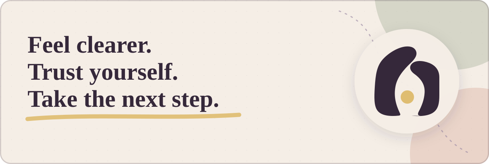
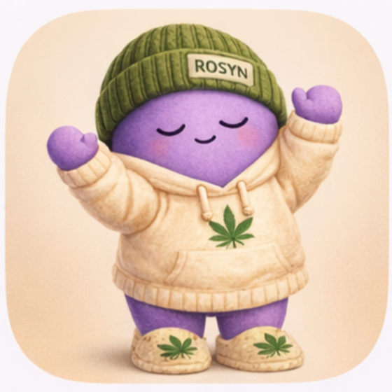
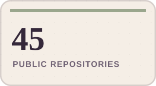
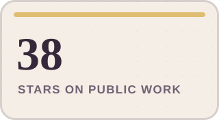
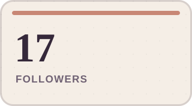
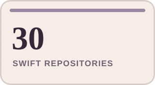

  

<h1 align="center">Mike Van Amburg</h1>

  <strong>Founder of Lunar Moth Studios</strong> 
  Feel clearer. Trust yourself. Take the next step. 
  <em>Soft on the person. Useful in the moment.</em>

## The work

I build warm, practical apps that help people feel clearer, trust themselves, and take the next useful step.

My work keeps returning to the same question:

> **How can software help people feel a little more supported in their actual lives?**

After working around mental health, anxiety, autism, fitness, and complex systems, I started **Lunar Moth Studios** to make smaller, warmer answers to that question—character-led apps for clarity, courage, and everyday self-trust.

GitHub is where I share the craft underneath those tiny worlds: product experiments, Swift foundations, small tools, and the honest work of making software feel human without pretending it is a human relationship.

## Meet the companions

### BRAM · Courage

  

<strong>One small brave thing a day.</strong>

BRAM helps someone practice one small, safe act of courage and build confidence through evidence—not pressure, performance, or a perfect streak.

<em>Confidence comes after you try.</em>

### Rosyn · Clarity

  

<strong>Understand your cannabis habits more clearly.</strong>

Rosyn helps adults privately notice their cannabis-use patterns and reflect on what is helping—or not helping—without shame or medical promises.

<em>A calmer, more intentional relationship with your own patterns.</em>

## What guides the work

- **Support without shame.** The product should meet a person where they are.
- **A next step, not a lecture.** Small, useful action beats pressure and optimization theater.
- **Character with honest boundaries.** Warmth matters; pretending software is a person does not.
- **Technology stays underneath.** AI, Swift, and systems are capabilities—not the reason someone should care.
- **Care is part of the architecture.** Accessibility, privacy, language, and emotional usability belong in the build from the beginning.

## The public workbench

  
  
  
  

<!-- profile-stats:start -->

<strong>45 public repositories</strong> · <strong>38 stars on public work</strong> · <strong>17 followers</strong> · <strong>30 Swift repositories</strong>

<!-- profile-stats:end -->

Most of my public work is written in Swift. It includes Apple-platform experiments, practical utilities, and open-source tools such as [`AnotherFuckingNetworkingSDK`](https://github.com/MikesHorcrux/AnotherFuckingNetworkingSDK)—a dependency-free networking layer built around modern Swift concurrency.

The cards above are generated directly from GitHub’s public API and refresh every Monday. No third-party stats service and no invented numbers.

---

  
   
  <strong>You do not have to carry this alone.</strong> 
  There is room for your next step.

